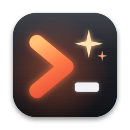
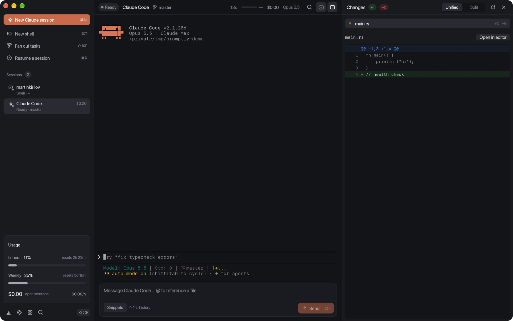
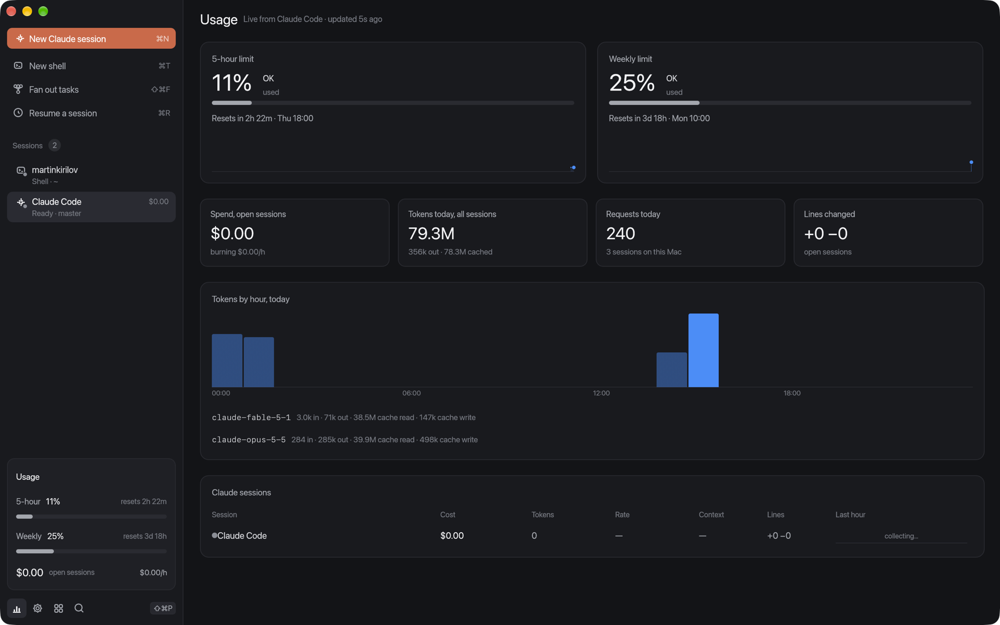
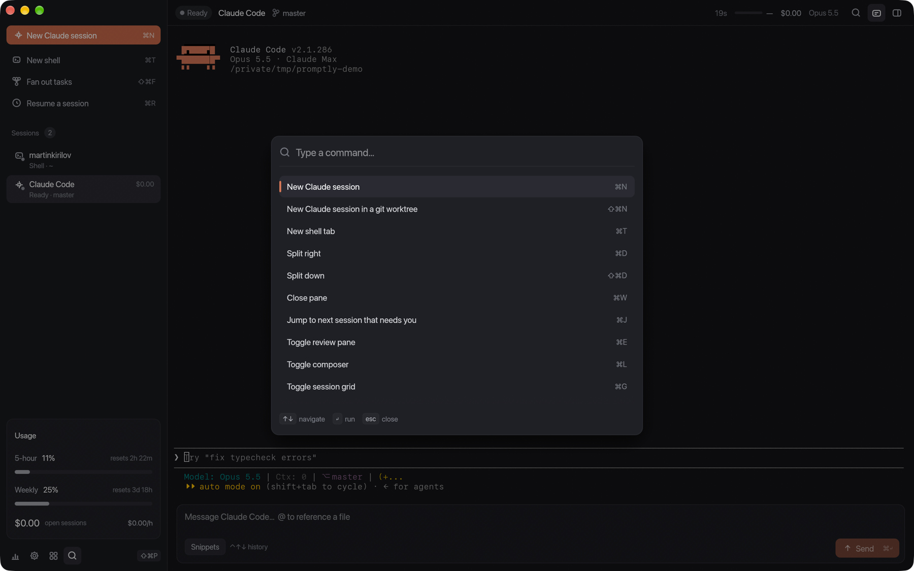
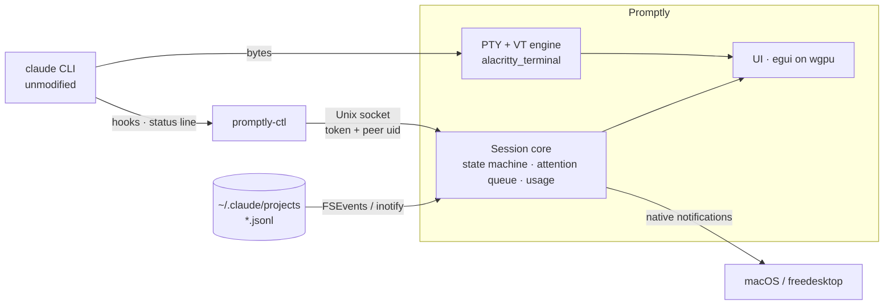

<div align="center">



# Promptly

**The terminal built for Claude Code.**

Run several Claude Code sessions side by side and know the moment one needs you.
See your plan usage live. Review what changed without leaving the window.

**[promptly website](https://martinykiriloff.github.io/promptly/)** · [MIT license](LICENSE.md) · [Latest release](https://github.com/martinykiriloff/promptly/releases/latest) · macOS (Apple silicon) and Linux



</div>

---

## Why Promptly

Agentic coding broke an old assumption. Terminals were built for one person typing
into one foreground process. Now you run three to eight Claude Code sessions at a
time. Each runs for minutes or hours and stops at unpredictable moments to ask for
permission, to ask a question, or because it's finished.

A normal terminal sees those sessions as streams of text. It can't tell that a tab in
the background has been waiting four minutes for you to approve `rm -rf build`, or that
another session just used 80% of your five-hour plan window. So you become the
bottleneck, cycling through tabs to check on them.

Promptly reads that structure for you:

- **It runs the real `claude` CLI, unmodified.** Nothing is forked or patched, so every
  Claude Code release works on day one.
- **It adds a side channel.** Session-scoped hooks, the status line feed and transcript
  tailing turn terminal output into events: *needs permission*, *waiting for you*,
  *done*, *cost changed*, *limit at 82%*.
- **It degrades gracefully.** If the side channel is unavailable (hooks disabled,
  managed settings, a schema change), you still have a fast, correct terminal.

---

## Highlights

### Never miss the moment Claude needs you

- **Session states that track Claude Code:** `Working`, `Needs approval`,
  `Waiting for you`, `Ready`, `Done` (files changed and the last test run passed),
  `Error`.
- **The *Needs you* queue** in the sidebar ranks sessions by urgency, then by how long
  they've waited. It shows the exact pending tool call, e.g.
  `Needs approval · Bash: npm publish`.
- **Native notifications** with deduplication, rate limiting, mute per session and
  priority per session. You aren't notified about the session you're looking at.
- **⌘J** jumps to the next session that needs you.
- Notifications only ever *take you to* a session. **Promptly never approves anything
  on your behalf.**

### Live usage, updating as Claude works



Claude Code reports your plan's rate limits to its status line. Promptly turns them
into a live view:

- **5-hour and weekly limit meters**, always in the status bar along the bottom of
  the window, next to the active session's context and cost.
- **Spend and burn rate** across the account's open sessions (`$1.24 · $3.10/h`),
  with numbers that animate as they change and a "live" indicator while tokens are
  flowing.
- **The usage dashboard (⌘U):**
  - reset countdowns ticking down to the second, and limit history sparklines
  - today's tokens across *every* Claude Code session of the account in use,
    including ones started outside Promptly, deduplicated per request
  - tokens by hour and per model
  - a per-session table with cost, tokens, burn rate, context %, lines changed and a
    one-hour spend sparkline
- **Limit alerts:** a notification when the 5-hour or weekly window crosses 80% and
  95%, once per window.
- Cost and limits come from Claude Code itself. Promptly doesn't estimate pricing.

### Many sessions, no collisions

- **One-key new session (⌘N).** It runs through your login shell, so `PATH`, `nvm` and
  `~/.local/bin` behave exactly as in your own terminal.
- **A git worktree per session** (⇧⌘N, or automatic per project profile). Each
  session gets its own `promptly/<task>` branch outside your checkout. Promptly won't
  remove a worktree that has uncommitted changes, and it always keeps the branch.
- **Fan out (⇧⌘F).** Paste a task list and get one Claude session per line, each in
  its own worktree, shown in a live grid.
- **Splits and tabs, plus a session grid (⌘G)** with live previews of every terminal.

### Review without leaving the terminal

- **A diff pane scoped to the session's worktree (⌘E).** It covers staged, unstaged
  and untracked changes, in unified or split view, and refreshes automatically when
  Claude edits files.
- **Click any line to comment.** Send all comments back to the session as one
  structured prompt.
- **Open in your `$EDITOR`.** Terminal editors open in a split; GUI editors jump to
  the line.

### A better way to write prompts

- **A docked composer (⌘L)** for long, structured prompts:
  - `@file` completion from your repo
  - history (⌃↑ / ⌃↓)
  - snippets
  - ⌘↵ to send
- Text goes into the session as a bracketed paste, exactly as if you'd typed it.
- **Shift+Enter works** through the Kitty keyboard protocol.

### Find any past conversation

- **Search every Claude Code session on your machine (⌘R)** by text or folder, using
  an SQLite FTS5 index of `~/.claude/projects`. Pick one to reopen it with
  `claude --resume`.
- **Layout restore:** quit Promptly and your sessions are offered back next launch.

### Keyboard-first, mouse-friendly



Every action lives in the **command palette (⇧⌘P)**. Every shortcut is rebindable.

---

## A real terminal first

Promptly is a daily-driver terminal on its own. Claude features stay out of the way
in plain shell panes.

| | |
|---|---|
| Emulation | xterm-class via `alacritty_terminal`: 256 colors and truecolor, alt screen, SGR/X10 mouse, bracketed paste, OSC 8 hyperlinks, OSC 52, Kitty keyboard protocol, synchronized output |
| Rendering | GPU through **wgpu** (Metal on macOS, Vulkan/GL on Linux), wide-character and emoji placement, font fallback chain, IME |
| Shell integration | Auto-injected for zsh, bash and fish (OSC 133 prompt marks, exit codes, OSC 7 cwd). Your rc files still run. |
| Scrollback | 100k lines, regex search (⌘F), word/line selection, ⌘-click URLs and paths |
| Accessibility | AccessKit for the interface, full keyboard navigation, reduced-motion and high-contrast options |

---

## Install

### Download

Grab the latest build from [Releases](https://github.com/martinykiriloff/promptly/releases):

| Platform | File |
|---|---|
| macOS 14+ (Apple silicon) | `Promptly-<version>-macos-arm64.zip` |
| Linux x86_64 / arm64 | `.deb` or `promptly-<version>-linux-<arch>.tar.gz` |

> **Heads-up for Mac users:** builds are **unsigned for now; notarization is coming**.
> macOS will say the app "can't be opened" the first time. Clear the quarantine flag once and it opens normally after that.

macOS builds are **not yet signed or notarized**. After unzipping,
clear the quarantine flag once:

```sh
xattr -dr com.apple.quarantine Promptly.app
```

### Updating

Promptly updates itself from this repository's
[Releases](https://github.com/martinykiriloff/promptly/releases):

1. It checks for a newer release at launch and every 6 hours. You can also run
   **Check for updates** from the command palette or **Settings › Updates**.
2. When one exists, an **Update available** card appears in the sidebar, and
   **Settings › Updates** shows **Update to vX** next to **Check now**. Click either.
3. Promptly downloads the build for your platform and verifies its SHA-256 against
   the release's `SHA256SUMS`. It won't install a build without a matching checksum.
4. It replaces `Promptly.app` (or the `promptly` and `promptly-ctl` binaries from the
   Linux tarball) in place.
5. Click **Restart now**. Your sessions are offered back on launch, and Claude
   sessions resume with `claude --resume`.

From a script: `promptly-ctl action check_updates`, then `promptly-ctl action install_update`.
To turn off automatic checks:

```toml
[updates]
check = false
```

`.deb` installs live under `/usr`, so update those with the newer `.deb` from the
release page. Development builds (`cargo run`) don't self-update.

> The first in-app update needs **v2026.2 or later** installed, because v2026.1 shipped
> without the updater. Install v2026.2 manually once; after that, Promptly updates
> itself.

### Build from source

Requires Rust 1.85+ and `git`. Claude Code (`claude`) should be on your `PATH`.

```sh
git clone https://github.com/martinykiriloff/promptly.git
cd promptly
cargo build --release --workspace
./target/release/promptly                 # run directly
./scripts/bundle-macos.sh                 # or build target/release/Promptly.app
cargo deb -p promptly                     # Linux .deb (needs cargo-deb)
```

`promptly-ctl` must sit next to the `promptly` binary. The bundle and the packages
already do this.

---

## Quick start

1. Launch Promptly and press **⌘N** for a Claude session, or **⌘T** for a shell.
2. Work as usual. Claude Code's own UI runs unchanged in the middle pane.
3. Start a second and third session. Switch to something else.
4. When one needs approval, it turns **amber**, appears under **Needs you**, and you
   get a notification. Press **⌘J** to jump to it.
5. Press **⌘E** to review what it changed, and **⌘U** to see how much of your plan
   you've used.

---

## Keyboard shortcuts

On Linux, *⌘* means **Ctrl+Shift**, because plain Ctrl belongs to the terminal.

| Action | Shortcut |
|---|---|
| Command palette | ⇧⌘P |
| New Claude session | ⌘N |
| New Claude session in a worktree | ⇧⌘N |
| New shell | ⌘T |
| Fan out tasks | ⇧⌘F |
| Jump to next session that needs you | ⌘J |
| Usage dashboard | ⌘U |
| Review pane | ⌘E |
| Composer | ⌘L |
| Session grid | ⌘G |
| Resume a past session | ⌘R |
| Find in scrollback | ⌘F |
| Split right / down | ⌘D / ⇧⌘D |
| Next / previous session | ⌘] / ⌘[ |
| Close pane | ⌘W |
| Font size | ⌘= / ⌘− |
| Session transcript | ⇧⌘T |
| Settings | ⌘, |

---

## Configuration

`~/.config/promptly/config.toml`. Every key is optional.

```toml
font_size = 13
scrollback_lines = 100000
shell_integration = true

[claude]
binary = "claude"
inject_hooks = true        # false = transcript-only mode
wrap_statusline = true     # read cost/limits, then run your own status line

[notifications]
enabled = true
on_finish = true
max_per_minute = 6

# Per-project profiles: the longest matching root wins.
[[profiles]]
name = "client-a"
root = "~/work/client-a"
model = "sonnet"
permission_mode = "plan"
mcp_config = "~/work/client-a/mcp.json"
worktree_per_session = true
env = { AWS_PROFILE = "client-a" }

[keybindings]
usage = "primary+u"
palette = "primary+k"

[snippets]
review = "Review the diff on this branch for bugs and missing tests."
tests = "Run the test suite and fix any failures."
```

---

## Scripting: `promptly-ctl`

```sh
promptly-ctl new-session --claude --cwd ~/api --worktree rate-limits --prompt "Add rate limiting"
promptly-ctl list                    # sessions as JSON: state, branch, cost, context %
promptly-ctl focus 3                 # by pane id or Claude session id
promptly-ctl action usage            # run any palette action by name
promptly-ctl notify "Deploy done" "api@1.4.2 is live"
```

It's handy from git hooks, Makefiles or CI scripts running locally.

---

## How it works



Each Claude session gets three independent signals:

1. **PTY passthrough.** The real Claude Code TUI.
2. **Hooks and status line.** Promptly passes a session-scoped `--settings` file that
   *adds* hooks. Your `~/.claude/settings.json` is never modified, and your own hooks
   and status line keep running.
   - The hook command is `promptly-ctl`, which forwards the hook JSON to a per-session
     Unix socket and exits. Measured round trip: **p50 3.2 ms, p95 5.6 ms**, against a
     20 ms budget.
   - The status line feed carries cost, tokens, context and plan limits.
3. **Transcript tailing.** Model, usage and first prompt. It also drives session state
   by itself when hooks are locked down by managed settings.

Losing any one signal degrades a feature, never the terminal.

---

## Security and privacy

- **No network listeners.** All IPC is over Unix sockets in a `0700` directory. Each
  session socket requires a random 256-bit token *and* a peer-uid check
  (`SO_PEERCRED` / `getpeereid`).
- **Never widens Claude's permissions.** Promptly doesn't auto-approve. Notifications
  only deep-link to the session.
- **Escape-sequence hygiene.** OSC 52 clipboard *read* is disabled, and a clipboard
  *write* asks once per session. Window titles have control and bidi characters
  stripped.
- **Paste protection.** Multi-line or control-character pastes show a preview first.
  Embedded paste terminators are removed so content can't escape bracketed-paste mode.
- **Credentials stay with the CLI.** Promptly never reads, stores or proxies API keys
  or logins.
- **Local only.** No account and no telemetry. The only network request Promptly
  itself makes is the update check to the GitHub Releases API, which you can turn
  off with `[updates] check = false`. "Copy diagnostics" redacts token-looking values.

---

## Project layout

| Crate | Role |
|---|---|
| `crates/promptly-core` | Everything that isn't pixels: state machine, hook injection, IPC, transcript tailing, usage and limits, attention queue, session index, git worktrees and diffs, config |
| `crates/promptly-ctl` | Hook binary and scripting CLI |
| `crates/promptly` | The desktop app: terminal panes, sidebar, usage dashboard, review, composer, palette |

```sh
cargo test --workspace     # unit + fixture tests

# Contract tests against your installed Claude Code (one tiny API call):
cargo build -p promptly-ctl && cargo build --release -p promptly-ctl
cargo test -p promptly-core --test claude_contract -- --ignored --nocapture
```

The contract tests check that injected hooks reach the socket, that the state machine
settles, that the transcript path and schema match, and that the hook latency budget
holds. Last verified against **Claude Code 2.1.286**.

---

## Roadmap

Next:

- [ ] Signed and notarized macOS builds; signed (not only checksummed) updates
- [ ] A separate PTY-owner process so sessions survive a UI restart
- [ ] Clicking a notification on macOS opens the session (needs the signed bundle)
- [ ] Ligatures (HarfBuzz shaping) and screen-reader access to the terminal grid
- [ ] Light theme
- [ ] Headless background agents via the Claude Agent SDK
- [ ] Checkpoint timeline: jump to a prior turn and fork
- [ ] Remote sessions over SSH
- [ ] License-key activation

---

## License

Promptly is released under the **[MIT License](LICENSE.md)**.

Use it for anything, personal or commercial. Read it, change it, redistribute it, build on it.
The only condition is that the copyright and license notice stay with the code.

Versions released before the switch to MIT were published under the Functional Source
License 1.1. The copyright holder has relicensed the project, so the current source and all
future releases are MIT.

---

<div align="center">

Promptly is an independent project and is not affiliated with Anthropic.
Claude and Claude Code are trademarks of Anthropic.

</div>
